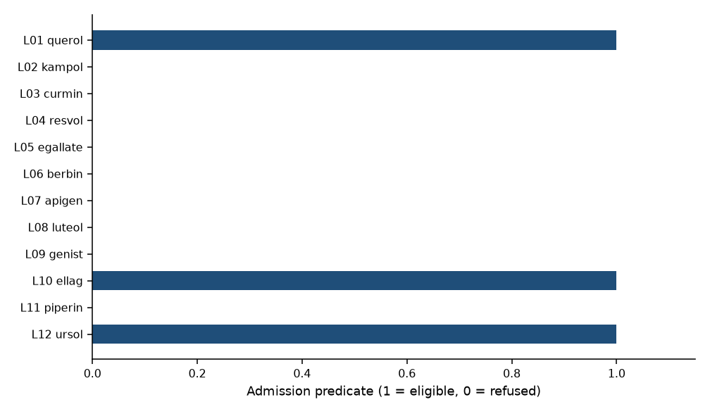
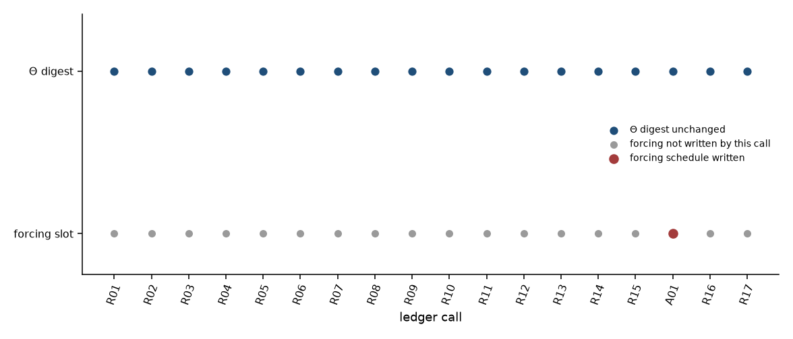
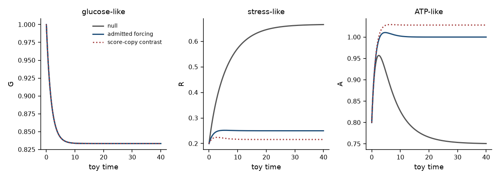
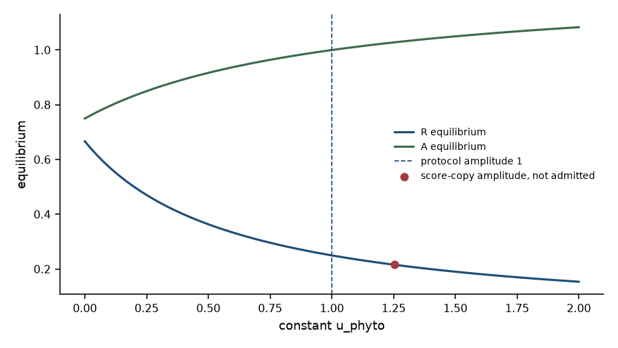

# Forcing admission under evidence gates: which phytochemical screen scores may enter a tip ODE as known forcings?

**Thesis #19. Computational research thesis**  
**Author:** Kelechi Emeka Ogbonna  
**Correspondence:** kelechiogbonna300@gmail.com · https://github.com/cloudynirvana/thesis-19-forcing-admission-gates-tip-ode  
**Date:** 21 September 2026  
**Format:** B.Sc. project chapters (Nile University style), written as a computational methods manuscript  
**Depends on:** Thesis #1 (evidence gates: knowledge ≠ Θ), Thesis #7 (TNBC tip ODE under known forcings), Thesis #16 (gated phytochemical / ΔΨm screen; scores ≠ Θ)  
**Status:** Admission ledger on transcribed claim records, plus a seeded-free trajectory check. Not a screen. Not an identifiability table.  
**Citation style:** numbered Vancouver. A `doi:` field appears only where Crossref, or MEDLINE for one pagination string, returned the record.  
**DOI:** none for this document. Do not invent one.

---

## Title page

**FORCING ADMISSION UNDER EVIDENCE GATES: WHICH PHYTOCHEMICAL SCREEN SCORES MAY ENTER A TIP ODE AS KNOWN FORCINGS?**

BY

**KELECHI EMEKA OGBONNA**

A COMPUTATIONAL RESEARCH THESIS  
(ADMISSION LEDGER ON A BOUNDED TIP-DEMONSTRATION ODE)

SUBMITTED AS A CITEABLE MANUSCRIPT FOR JOURNAL / THESIS HANDOFF

PROJECT CONFLUENCE  
INDEPENDENT COMPUTATIONAL RESEARCH

SUPERVISOR: not appointed for this deposit

SEPTEMBER 2026

---

## Declaration

I, Kelechi Emeka Ogbonna, declare that this computational research thesis was carried out by me. The refusals, the single admission, the digests, and the trajectories reported here were produced by `sim/admission.py` from the transcribed ledger in `sim/candidates.json`. They are not wet-lab measurements, not docking poses, and not patient outcomes. No DOI, ORCID, or journal acceptance was invented for this document.

_________________________     _______________________  
Kelechi Emeka Ogbonna         Date

---

## Abstract

When a phytochemical screen is barred from writing scores into Θ, which of those scores—if any—may be admitted as declared known forcings into a tip ODE without bypassing evidence gates or leaking through soft priors?

On the ledger in Chapter Three, a score may authorize one predeclared forcing schedule. It may not become the amplitude of that schedule, a prior mean, a weight on a kinetic objective, or a coordinate of Θ. Twelve claim records were transcribed from Thesis #16 and were not re-scored. The admission predicate, applied with an empty slot and the protocol-constant rule, holds for L10, L01, and L12. It fails for the other nine rows. L05 carries the largest transcribed utility, 0.770833, and remains ineligible.

Eighteen calls were then issued. Seventeen returned refused. The SHA-256 of Θ was `1ace2bb9eed19f85046f25ab690076d0d5920cf19219ddb362c775be9f41d0e8` before those calls and the same string after them, including after the one admission. Call A01 admitted row L10. The forcing is the constant `u_phyto = 1` on the toy interval [0, 40]. The numeral 1 is a protocol constant. The provenance flag `score_copied` is false, and no transcribed score string appears in the forcing payload. The forcing digest moved from `8a1b1dce9b092d9b587060e02fbcc0d386fde1262f4955dea32bdfede99c87de` to `67b6e4bfb3028c04c14c2662b1df8c9730045e680b1bee6fdbbb97a017ef0d15`. Two later refusals left that second digest in place.

The demonstration field is a bounded three-state cousin of the input–parameter split. It is not the frozen TNBC right-hand side, and no Fisher rank was computed. With Θ held fixed, the glucose-like coordinate is blind to `u_phyto`: the maximum absolute gap between the null and admitted glucose paths on the stored grid is 1.268×10−9. The stress-like coordinate is not blind to it. Its equilibrium moves from 0.666667 to 0.250000, and the maximum absolute gap between the two full state paths is 0.415620. The state digest therefore changes while the kinetic digest does not.

A normal–normal contrast, fed by the transcribed L05 AMPK score, would have replaced `d0 = 0.15` with posterior mean 0.186979 and would have changed the kinetic digest. That value was computed in a side buffer and was not written. Research only. Not a medical device and not an efficacy claim.

---

## Keywords

evidence gate; forcing admission; kinetic parameter; phytochemical score; soft prior; ordinary differential equation; ledger digest; tip-demonstration model; research only

---

## Table of Contents

DECLARATION  
ABSTRACT  
Table of Contents  
List of tables and figures  

CHAPTER ONE. INTRODUCTION  
1.1 Background to the study  
1.2 STATEMENT OF RESEARCH PROBLEM  
1.3 JUSTIFICATION OF STUDY  
1.4 AIM AND OBJECTIVES OF THE STUDY  
1.5 SIGNIFICANCE OF THE STUDY  
1.6 SCOPE OF THE STUDY  

CHAPTER TWO. LITERATURE REVIEW  
2.1 A score is knowledge until an identification step says otherwise  
2.2 A known forcing is an input  
2.3 A soft prior is a write with a variance attached  
2.4 Screening numbers have their own failure modes  
2.5 What this deposit does not inherit  

CHAPTER THREE. MATERIALS AND METHODS  
3.1 Design  
3.2 Transcribed candidates  
3.3 The admission predicate  
3.4 Kinetic Θ and the demonstration field  
3.5 Digests  
3.6 Calls  
3.7 Contrasts that stay outside the ledger  
3.8 What was not done  

CHAPTER FOUR. RESULTS  
4.1 Who is eligible  
4.2 Seventeen refusals, one digest  
4.3 The legal path  
4.4 The state moves, Θ does not  
4.5 Contrasts  
4.6 Checks  

CHAPTER FIVE. DISCUSSION, CONCLUSION AND RECOMMENDATION  
5.1 Discussion  
5.2 Conclusion  
5.3 Recommendation  

REFERENCES  
DISCLAIMER  

---

## List of tables and figures

**Table 3-1.** Kinetic Θ. Decimal strings are the hashed object.  
**Table 3-2.** Predicate checks and the reason codes they emit.  
**Table 4-1.** Eligibility of the twelve transcribed rows.  
**Table 4-2.** Ledger calls.  
**Table 4-3.** State samples under the null schedule and the admitted schedule.  
**Table 4-4.** Equilibria and terminal gaps.

**Figure 4-1.** Eligibility of the twelve rows.  
**Figure 4-2.** Kinetic digest and forcing writes across the eighteen calls.  
**Figure 4-3.** State paths.  
**Figure 4-4.** Equilibria against a constant input.

Figures are diagnostics from `sim/admission.py`. They are not measured time series.

---

# CHAPTER ONE

## 1.0 INTRODUCTION

### 1.1 Background to the study

Triple-negative breast cancer is a clinical research grouping with subtypes and a documented heterogeneity [1–3]. The cancer hallmark lists, including the metabolic dimension added in the later revisions, are narrative taxonomies [4,5]. Warburg’s aerobic glycolysis, and the later restatements of it as a proliferative programme, explain why a small metabolic cartoon is a tempting object [6–8]. Mathematical oncology already treats such cartoons as in-silico laboratories [9]. Systems biology asks that a model be a formal object, and that robustness be a property one can fail to find [10,11]. May’s warning still applies before any of that biology is invoked: an equation borrowed from a neighbour has to be the equation the prose describes [12]. Saltelli and colleagues make the same demand of any model that might be mistaken for a decision [13].

This author’s portfolio already contains three objects that sit next to one another and do not answer the same question.

Thesis #1 specifies evidence gates for binding an oncology knowledge graph to a frozen cancer-state model. The conversion ladder may point from knowledge toward a parameter. It may not collapse into one. A literature record is not Θ [14].

Thesis #7 freezes a three-state TNBC ATP–ROS–glucose ordinary differential equation and asks which kinetic coordinates are structurally and practically identifiable when phytochemical and nanocarrier symbols are treated as known forcings. In that manuscript the symbols `N_DOX` and `N_ROS` are inputs. They are not efficacy, and a roadmap sentence about a tip shift is not a result of the Fisher tables [15].

Thesis #16 freezes a twelve-row toy library and scores it with a linear surrogate on a membrane-potential proxy and three regulator columns. The scores remain evidence. Promotion into a kinetic coordinate returns refused, the claim ceiling stops at a nomination for a future observation channel, and the SHA-256 of that thesis’s own θ is unchanged by the refusals. The same roadmap sentence is refused there as text [16].

The three results can be stated in one breath. Knowledge is not Θ [14]. A declared forcing is an input, once it is already declared [15]. A screen score is not Θ [16]. None of those sentences says when, if ever, a score that has been barred from Θ may be the thing that *declares* the forcing. Without that sentence, a later notebook can leave the kinetic vector untouched, copy a score into an input slot, and describe the copy as compliance with both gates. That copy is the hole this thesis is for.

### 1.2 STATEMENT OF RESEARCH PROBLEM

When a phytochemical screen is barred from writing scores into Θ, which of those scores—if any—may be admitted as declared known forcings into a tip ODE without bypassing evidence gates or leaking through soft priors?

The working form is narrow. There is a transcribed table of twelve claim records [16]. There is one kinetic vector Θ, hashed as decimal strings. There is one forcing symbol, `u_phyto`, whose schedule is hashed separately. There is a predicate, fixed in `sim/admission.py` before the calls are issued. There is one legal amplitude rule: a protocol constant, chosen in the script, which is not a function of a score. The question is which calls the predicate admits, and whether a refusal or a legal admission changes the digest of Θ.

Collapse, if it happens, is a property of this ledger. A familiar way to miss the question is to treat a C3 nomination as permission to paste the score into the differential equation, or to centre a Gaussian prior on a kinetic coordinate at a function of the score and call the prior “soft.” Both of those are calls in Chapter Four. Both return refused.

### 1.3 JUSTIFICATION OF STUDY

The portfolio has the pieces and lacks the joint.

Thesis #1 forbids a knowledge record from becoming a parameter. It does not audit a forcing schedule [14]. Thesis #7 *uses* known forcings, and it is explicit that the forcings are known numerical inputs rather than fitted treatments [15]. The identifiability literature that thesis relies on makes the same split: an experiment has inputs and outputs, and the parameter vector is what the input–output map may or may not recover [17–22]. That literature does not, by itself, say which upstream score is allowed to set the input. Thesis #16 stops the score on the other side of the gate. Its promotion function has no success branch into θ [16]. A reader who holds only that result can conclude that no score may enter the dynamics in any role. A reader who holds only Thesis #7 can conclude that a phytochemical symbol may sit in the vector field as soon as someone has typed a number. The two readings contradict each other, and neither reading is an admission rule.

The study is justified as the rule that keeps both readings from winning by default. A score that clears a predeclared predicate may authorize a schedule whose amplitude was written down without consulting the score. A score that fails the predicate authorizes nothing. A score that clears the predicate and is then used as the amplitude, as a prior mean, or as a coordinate of Θ, is a bypass. The bypass is what the digest is for. If Θ moved, the gate failed. If the forcing moved under a refused call, the gate failed in the other slot.

The justification is methodological [12,13,23]. It is not a phytochemical monograph and not a tipping-point measurement [6–8,15,16].

### 1.4 AIM AND OBJECTIVES OF THE STUDY

The aim is to state an admission predicate under which a gated screen score may become the provenance of a known forcing in a tip-demonstration ODE, and to show, on transcribed records, which calls the predicate refuses and which single call it admits, with the digest of kinetic Θ unchanged on the refusals.

The objectives are:

1. Transcribe the Thesis #16 claim records, library pin, and anecdote as an input file, and pin the file’s own SHA-256 so a silent edit raises.
2. Define kinetic Θ and a forcing schedule as separately hashed objects, and define a bounded demonstration field in which the forcing appears only as an exogenous input.
3. State the predicate: library pin, empty engine, surrogate unit, `may_enter_theta` false, claim equal to 3, PAINS flag clear, destination equal to `u_phyto`, amplitude rule equal to `protocol_constant`, and a single empty slot.
4. Issue the illegal calls in Section 3.6, including direct writes into Θ, a soft prior, a score-copied amplitude, an affine amplitude, the roadmap anecdote, a PAINS row, a C2 row, a utility write, a broken pin, a forged engine name, a forged claim, a score weight, and a foreign symbol.
5. Admit one legal schedule, then show that a second eligible row does not replace it.
6. Integrate the field under the null schedule and under the admitted schedule with Θ held fixed, and record the state digests.
7. Compute the soft-prior and score-amplitude contrasts in a side buffer and check that the ledger digest is the baseline digest afterwards.

Non-aims. Recomputing Thesis #16 ranks or surrogate weights. Recomputing Thesis #7 Fisher ranks, profile likelihoods, or `G_tip`. Editing the published TNBC right-hand side. Claiming that an admitted schedule is a dose, a membrane-potential effect, or a change in any kinetic constant.

### 1.5 SIGNIFICANCE OF THE STUDY

The useful product is a rule that can fail in public. If L05 were eligible, the PAINS check would have failed. If A01 changed the kinetic digest, the separation of Θ from the forcing would have failed. If the glucose-like coordinate moved with `u_phyto` by more than integrator noise, the field would not be the field written in Section 3.4. Those checks can be rerun without accepting a clinical sentence [12,13].

There is a second product inside the same script. Eligibility is a property of a row under the predicate. Admission is a write into a single slot. L01 and L12 are eligible and are not the admitted row. A later call that names L01 after the slot is full returns refused for occupancy, not because the row became a worse score. The rule can therefore refuse a second write without reopening the screen.

What the significance is not: a ranking of phytochemicals, a Fisher table, a dose, or a licence to paste the next surrogate into `N_ROS` [14–16].

### 1.6 SCOPE OF THE STUDY

In scope. The predicate in Section 3.3. The eighteen calls in Section 3.6. The hashed kinetic vector in Table 3-1. The bounded field in Section 3.4, integrated on [0, 40] from the stated initial condition. Closed forms for the glucose-like and stress-like coordinates. One side-buffer prior and two side-buffer amplitudes.

Out of scope. Patient data. Docking. A PAINS SMARTS evaluation. Any refit of Θ. The quadratic ROS term and the constant glucose sink of the published TNBC model [15]. The `G_tip` functional. A stochastic likelihood, except the one normal–normal contrast that is not written. A second admitted schedule. Regulatory use.

---

# CHAPTER TWO

## 2.0 LITERATURE REVIEW

### 2.1 A score is knowledge until an identification step says otherwise

Structural identifiability is a property of a model class and an experiment [17]. It asks whether the input–output map determines the parameter vector, not whether a neighbouring table of scores looks decisive. Global tests for arbitrary parametrizations make the same demand [19]. In physiological models the quantity the data actually see is often a combination, and the combination is not a licence to publish every symbol that was typed into the equation [18]. Profile likelihood later separates a flat structural direction from a valley that finite noise fails to close [20,21]. Practical identifiability is about the experiment that was run [22]. Sloppy spectra warn that a full-rank Fisher matrix can still leave individual coordinates poorly constrained [23]. Nonlinear ODE models, including the viral examples in the identifiability reviews, remain only partly observed even when the equations are known [24,25]. Subset profiling is the constructive counterpart when a single coordinate is not identifiable and a combination is [26]. Parameter estimation for a biochemical model is a separate task from declaring that a literature number already is the parameter [27].

Thesis #1 uses that stack as a gate rather than as a new identifiability certificate. OnCo may name a gene. The name does not become a coordinate of the frozen cancer-state model [14]. The sentence required here is one step downstream of that gate. A screen score is a knowledge-like record with a numeral attached. The numeral does not, by being a numeral, complete an identification step [17,20,27]. Thesis #16 already recorded the score as evidence and refused the write into θ [16]. This chapter does not repeat that refusal as a new screen. It uses it as a premise.

### 2.2 A known forcing is an input

Control and identification treat inputs as part of the experiment, not as parameters to be smuggled back out of the data [19,28]. A molecular systems model can carry exogenous signals. Those signals are arguments of the vector field. They are not coordinates of Θ merely because a biologist has a name for them [28]. Biological relativity makes a related caution at another scale: no organisational level owns causation just by being named [29]. The modelling demand underneath both remarks is ordinary. Assumptions should be visible, because a model is a set of choices a reader must be able to contest [30].

Thesis #7 makes the split concrete on a published three-state field. `N_DOX` and `N_ROS` are piecewise-constant inputs. The kinetic vector is eight coordinates that do not include those two symbols. A notebook that rewrites a rate inside a “treated” dictionary is changing Θ. It is not applying a forcing [15]. The present thesis keeps that distinction and refuses a further shortcut: taking a score that Thesis #16 barred from Θ and inserting it as if it were already one of those known inputs. The shortcut would launder an evidence record into the experiment’s design matrix. Declaring the schedule in advance, and storing the score only as provenance, is the alternative the predicate implements.

The field integrated in Chapter Four is not the Thesis #7 field. Section 3.4 says so, and says why. The logical split is the object under test. The particular right-hand side is a carrier.

### 2.3 A soft prior is a write with a variance attached

A prior is not a decorative belief. It is part of the posterior, and it is often intelligible only once the likelihood is stated [31]. Prior–data conflict is a check one can run when the prior and the observation disagree, not a reason to hide the prior inside a default [32]. Bayesian calibration of a computer model has the same exposure: the statistical layer can attribute discrepancy to a parameter, and the attribution depends on what was allowed to move [33]. Model discrepancy, left unstated, is easily absorbed into a physical parameter the investigator meant to keep fixed [34]. Box’s remark that all models are wrong is useful here only in its narrow form. The scientific task is to keep the wrongness inspectable [35].

The leakage this thesis refuses is specific. Let a kinetic coordinate keep its declared value, and let a Gaussian prior for that coordinate have a mean that moves when a screen score moves. A normal–normal update then returns a posterior mean different from the declared value. Writing the posterior mean back is a write into Θ. Leaving it unwritten and still citing the score as “regularisation” of the same coordinate is the same write described more gently. Chapter Three puts the update in a side buffer. Chapter Four records the posterior mean and the digest that mean would have produced, and records that the ledger digest did not become that digest.

An affine map from a score onto a forcing amplitude is the input-side version of the same habit. The variance is absent, so the map is harder, not softer. The predicate rejects it under the amplitude rule.

### 2.4 Screening numbers have their own failure modes

Pan-assay interference filters exist because some structures light up assays for reasons that are not the intended binding event [36]. A short commentary on chemical con artists makes the laboratory point for a general reader [37]. Docking scores have a separate literature of warning: a decisive number can fail to be an affinity [38–41]. A widely used docking engine does not cancel that warning [42]. Natural products remain a documented source of discovery starting points [43–45]. A starting point is not a kinetic constant, and a mnemonic label in a toy table is not the natural product a reader may hear in the label [16,43].

Thesis #16 already used that literature to keep a surrogate from being narrated as a docking campaign. The engine field was empty. This thesis does not reopen the surrogate. It does add one predicate check that the engine field is still empty, because an admission rule that ignored a forged engine name would admit a score under false provenance [39,42]. The PAINS flag transcribed from Thesis #16 is a stored bit, not a SMARTS evaluation performed here [36]. The predicate reads the bit. It does not rediscover it.

### 2.5 What this deposit does not inherit

Reproducibility, in the narrow sense used here, means that a second run of the same bytes produces the same digests [46–49]. It does not mean that the toy equilibrium is a mitochondrial membrane potential, and it does not mean that a reader may copy the protocol amplitude into a laboratory protocol [13,49]. FAIR recording is cited for the pin and the provenance fields, not as a claim that this deposit is a clinical dataset [47].

Three inheritances are refused explicitly.

The Fisher ranks, profile intervals, and `G_tip` numbers of Thesis #7 are not results of this thesis [15]. The rank order and the surrogate weights of Thesis #16 are not recomputed [16]. The knowledge-graph adapter of Thesis #1 is not rebound [14]. Each of those manuscripts remains the authority for its own object. This manuscript cites them as prior portfolio objects and then does a different thing: it decides whether a record those objects already classified may authorize an input.

---

# CHAPTER THREE

## 3.0 MATERIALS AND METHODS

### 3.1 Design

Computational ledger study. No patient-identifiable data. No wet-lab assay. No docking engine. No random-number draw: `rng_draws` in `sim/results.json` is 0.

The input file is `sim/candidates.json`. Its SHA-256 is pinned inside `sim/admission.py`. A byte-level mismatch raises before any call is issued. The pin for the file as stored in this deposit is `6252fcb50627caba3e0f8eb99043ca52535c59e62350f0ed27dc3fd6653f34c4`.

Materials otherwise are the three prior theses [14–16], the identifiability and prior literature cited in Chapter Two [17–35], and the screening caveats cited there [36–45]. The demonstration field was written for this ledger. It was not taken from `tnbc_model.py`.

### 3.2 Transcribed candidates

The file records twelve rows. Each row carries an identifier, a mnemonic label, a PAINS bit, a utility, a claim level, a top-quartile count, and four score strings (membrane proxy, AMPK, PI3K, GLUT1). Those strings are copies of the values in Thesis #16’s `sim/results.json`. They were not produced by rerunning the surrogate. Ranks were not copied. The library SHA-256 transcribed with them is `46d685fbeccf5b7b8facf06623c6d46f34f7aa1c91fc3bed2fec0cd0fcc68a16`. The engine field on the file is null. The unit is `arbitrary_surrogate`. The flag `may_enter_theta` is false.

The anecdote object stores one sentence and two flags: an unpublished roadmap mentioned `G_tip` moving from 0.238 to 0.245; `recomputed_here` is false; `may_enter_theta` is false. Thesis #16’s kinetic digest `0b85bb8afb97637e5d4e880ec2dd2fdfc8673be14ff6fd499208c31bae50ef6b` is stored in the file as a citation. It is not the Θ of this thesis, and no call is allowed to treat it as such.

Utility and the score strings exist so that a refused contrast can name the numeral it did not write. The predicate in Section 3.3 does not read them.

### 3.3 The admission predicate

A call is a request with a kind, an optional row, a destination symbol, and an amplitude rule. The script collects every failed check. An empty failure list means the call may be admitted. The slot check is applied only when every other check has passed, so a call that is illegal for a substantive reason is not also labelled as a mere occupant of a full slot.

**Table 3-2.** Checks, in the order the script records them.

| Check | Reason code | Admitted value |
| --- | --- | --- |
| Kind is a score record, not the anecdote | `not_a_score_record` | kind = score |
| Kind is not a utility write | `utility_not_an_input` | kind = score |
| Rule is not a soft prior | `soft_prior` | amplitude rule = protocol_constant |
| Rule is not a score weight on a kinetic objective | `soft_weight` | amplitude rule = protocol_constant |
| Destination is not a name in Θ | `theta_destination` | destination = `u_phyto` |
| Destination is the declared forcing symbol | `symbol` | destination = `u_phyto` |
| Library SHA-256 equals the transcribed pin | `library_sha` | pin in Section 3.2 |
| Engine is null | `engine` | null |
| Unit is `arbitrary_surrogate` | `unit` | that string |
| `may_enter_theta` is false | `may_enter_theta` | false |
| Claim level is 3 | `claim` | 3 |
| PAINS bit is 0 | `pains` | 0 |
| Amplitude rule is `protocol_constant` | `amplitude_rule` | protocol_constant |
| Forcing slot is still the null schedule | `slot_occupied` | one write only |

Claim level 3 is the Thesis #16 code for a nomination of a future observation channel, which in that thesis required a clear PAINS flag and two top-quartile columns [16]. This predicate reads the stored claim. It does not recompute the quartile count. Claim level 4, an identified kinetic parameter, remains unreachable: a call that overwrites the stored claim to 4 fails the claim check.

The amplitude that a successful call writes is the string `"1"`, constant on [0, 40]. That string is not taken from a score. Provenance on the written schedule records the row identifier, the claim, the PAINS bit, the library pin, and `score_copied: false`. It does not record the score.

### 3.4 Kinetic Θ and the demonstration field

Θ is six positive constants. They are stored as decimal strings so that the digest does not depend on a binary float’s JSON rendering.

**Table 3-1.** Kinetic Θ.

| Name | Role in the field | Stored string |
| --- | --- | --- |
| `u_in` | constant influx of the glucose-like state | 0.50 |
| `k_glyc` | linear consumption of that state | 0.60 |
| `g` | yield of the stress-like state | 0.20 |
| `d0` | basal clearance of the stress-like state | 0.15 |
| `d_u` | extra clearance per unit of forcing | 0.25 |
| `s` | linear clearance of the ATP-like state | 0.40 |

Let G be a glucose-like state, R a stress-like state, and A an ATP-like state, all dimensionless. Let `u(t)` be the forcing. On this deposit `u(t)` is constant, either 0 or the admitted value. The field is

dG/dt = u_in − k_glyc G

dR/dt = g k_glyc G − (d0 + d_u u) R

dA/dt = k_glyc G / (1 + R) − s A

The forcing multiplies `d_u` inside the clearance of R. It does not appear in the equation for G. It does not replace any coordinate of Θ. Initial state: (G, R, A) = (1, 0.20, 0.80). Horizon: t ∈ [0, 40]. Integration: LSODA, relative tolerance 10−8, absolute tolerance 10−11, 401 stored nodes.

The equilibrium at a constant input u is closed form:

G* = u_in / k_glyc

R* = g u_in / (d0 + d_u u)

A* = u_in / (s (1 + R*))

G* does not depend on u. That is the algebraic content of the separation. With the numbers in Table 3-1, the null input u = 0 gives G* = 0.833333, R* = 0.666667, A* = 0.750000. The protocol input u = 1 gives the same G*, R* = 0.250000, and A* = 1.000000.

G(t) and R(t) also have closed forms for constant u, because the glucose equation is linear and the stress equation is linear once G(t) is known. The script compares those forms with the numerical trajectory and raises if the maximum absolute gap exceeds 10−7. The ATP equation sees R(t) in a denominator, so A(t) is numerical. Its equilibrium formula is still algebraic.

This field is a bounded carrier for the ledger. It is not `tnbc_model.py`. It has no quadratic source term, and the glucose equation is mass-conserving in the limited sense that the forcing does not drain G by a constant. Those are choices. They keep the admission effect visible on [0, 40]. They are not a repair offered back to Thesis #7, which declined to edit its own right-hand side [15].

### 3.5 Digests

The digest of an object is the SHA-256 hex digest of its canonical JSON: keys sorted, separators `(',', ':')`, UTF-8, no insignificant whitespace. Θ is digested from the decimal strings in Table 3-1. The forcing schedule is digested as its own object, including provenance when a schedule has been admitted. A state digest is the SHA-256 of the 401 stored samples after rounding time to 10 decimal places and each state to 12 decimal places.

A call is required to leave the byte string of Θ unchanged. The script compares that byte string at the end of the run with the byte string taken before the first call. A refused call is also required to leave the forcing digest unchanged. After A01, a later refusal is required to leave the admitted forcing digest unchanged.

### 3.6 Calls

Eighteen calls are issued in a fixed order. The first fifteen are constructed so that each substantive reason in Table 3-2 has at least one witness. A01 is the legal call: row L10, destination `u_phyto`, amplitude rule `protocol_constant`, stored flags untouched. R16 names L01, which the predicate finds eligible, after the slot is full. R17 names L12 and asks to copy a score into the amplitude after the slot is full. R17 should fail the amplitude rule, and the forcing digest should remain the digest A01 wrote.

The illegal constructions are: L05’s score aimed at `d0`; L12’s score aimed at `d_u`; a soft prior on `d0` driven by L05; L10’s score copied into `u_phyto`; an affine map of L05’s AMPK score proposed as `u_phyto`; the anecdote proposed as a forcing; L05 asked to authorize the protocol schedule; L08, a clear-PAINS C2 row, asked to authorize it; L10’s utility aimed at `g`; L10 with one hex character of the library pin flipped; L10 with engine set to `vina`; L10 with `may_enter_theta` set true; L10 with the claim overwritten to 4; a score weight aimed at `s`; and the protocol schedule aimed at the symbol `N_ROS`, which this ledger does not declare.

No call reads a rank. No call refits Θ.

### 3.7 Contrasts that stay outside the ledger

Three numerals are computed after the calls, in objects that are not assigned to the ledger.

The soft prior uses the transcribed L05 AMPK score S = −3.6979166666666665. The prior mean of `d0` is 0.15 + 0.02 × (−S). The fictional observation is the declared value 0.15. Both the prior and the observation have standard deviation 0.05, so the posterior mean is the average of the prior mean and 0.15. The script hashes the kinetic vector that would result from replacing the stored `d0` string with that posterior mean. It does not perform the replacement.

The score-copy amplitude is u = −S_AMPK for row L10. The affine amplitude is u = 0.20 + 0.50 × (−S_AMPK) for row L05. Both are integrated with the baseline Θ so that Chapter Four can show they are different inputs. Neither integration is allowed to replace the forcing object. The anecdote is not numerically recomputed. The pair 0.238 to 0.245 stays text [15,16].

### 3.8 What was not done

No descriptor was rescored. No rank was recomputed. No Fisher matrix of the TNBC three-state model was formed [15]. No profile likelihood of that model was drawn. `G_tip` was not evaluated. AutoDock Vina, Glide, GOLD, and RDKit were not run [42]. The PAINS bit was not derived from a structure [36]. Θ was not estimated from data. The normal–normal update is an arithmetic witness, not a posterior from a dynamical likelihood [31,32]. A global structural-identifiability certificate was not computed [17,25]. No dose was recommended [13].

---

# CHAPTER FOUR

## 4.0 RESULTS

Every status, digest, and trajectory number in this chapter comes from `sim/admission.py` writing `sim/results.json`. The run makes no random draw. The numbers are properties of the ledger and the field. They are not patient outcomes.

### 4.1 Who is eligible

The predicate of Section 3.3, evaluated on each transcribed row with the protocol-constant rule, the declared symbol, the stored flags, and an empty slot, returns eligible for three identifiers: L01, L10, and L12. Those are the three rows whose transcribed claim is 3 and whose PAINS bit is 0. The other nine rows return a claim failure, a PAINS failure, or both. Figure 4-1 is that pattern and nothing else. The bar height is 1 or 0. It is not a score.

**Table 4-1.** Eligibility. Utility is transcribed and is not an input to the predicate.

| ID | Label | Claim | PAINS | Utility | Eligible | Reason if refused |
| --- | --- | ---: | ---: | ---: | --- | --- |
| L01 | querol | 3 | 0 | 0.666667 | yes | — |
| L02 | kampol | 2 | 0 | 0.562500 | no | claim |
| L03 | curmin | 2 | 0 | 0.500000 | no | claim |
| L04 | resvol | 2 | 0 | 0.354167 | no | claim |
| L05 | egallate | 2 | 1 | 0.770833 | no | claim, pains |
| L06 | berbin | 2 | 0 | 0.520833 | no | claim |
| L07 | apigen | 2 | 0 | 0.375000 | no | claim |
| L08 | luteol | 2 | 0 | 0.625000 | no | claim |
| L09 | genist | 2 | 0 | 0.500000 | no | claim |
| L10 | ellag | 3 | 0 | 0.687500 | yes | — |
| L11 | piperin | 2 | 0 | 0.312500 | no | claim |
| L12 | ursol | 3 | 0 | 0.625000 | yes | — |

L05 has the largest utility in the file and is ineligible. L08 has the same utility as L12, to the stored digits 0.625, and only L12 is eligible. The predicate is reading the claim and the PAINS bit. It is not sorting the utility column. The eligible set matches the C3 set transcribed from Thesis #16. Matching that set is a check on the transcription and on the predicate. It is not a new shortlist.

**Figure 4-1.** A bar of height 1 is an eligible row. A bar of height 0 is refused by the predicate before any schedule is written. L01, L10, and L12 are the eligible rows.

### 4.2 Seventeen refusals, one digest

The kinetic digest before any call is

`1ace2bb9eed19f85046f25ab690076d0d5920cf19219ddb362c775be9f41d0e8`.

The null forcing digest is

`8a1b1dce9b092d9b587060e02fbcc0d386fde1262f4955dea32bdfede99c87de`.

**Table 4-2.** Calls in issue order. Every row has `theta_unchanged` true. Reason codes are those in Table 3-2.

| Call | Row | Destination | Amplitude rule | Status | Reasons |
| --- | --- | --- | --- | --- | --- |
| R01 | L05 | `d0` | copy_score | refused | theta_destination, claim, pains, amplitude_rule |
| R02 | L12 | `d_u` | copy_score | refused | theta_destination, amplitude_rule |
| R03 | L05 | `d0` | soft_prior | refused | soft_prior, theta_destination, claim, pains, amplitude_rule |
| R04 | L10 | `u_phyto` | copy_score | refused | amplitude_rule |
| R05 | L05 | `u_phyto` | affine_score | refused | claim, pains, amplitude_rule |
| R06 | anecdote | `u_phyto` | copy_score | refused | not_a_score_record |
| R07 | L05 | `u_phyto` | protocol_constant | refused | claim, pains |
| R08 | L08 | `u_phyto` | protocol_constant | refused | claim |
| R09 | L10 | `g` | copy_score | refused | utility_not_an_input, theta_destination, amplitude_rule |
| R10 | L10 | `u_phyto` | protocol_constant | refused | library_sha |
| R11 | L10 | `u_phyto` | protocol_constant | refused | engine |
| R12 | L10 | `u_phyto` | protocol_constant | refused | may_enter_theta |
| R13 | L10 | `u_phyto` | protocol_constant | refused | claim |
| R14 | L10 | `s` | soft_weight | refused | soft_weight, theta_destination, amplitude_rule |
| R15 | L10 | `N_ROS` | protocol_constant | refused | symbol |
| A01 | L10 | `u_phyto` | protocol_constant | admitted | — |
| R16 | L01 | `u_phyto` | protocol_constant | refused | slot_occupied |
| R17 | L12 | `u_phyto` | copy_score | refused | amplitude_rule |

Several rows of Table 4-2 are the cases that would be easy to narrate as exceptions.

R02 names L12, which Table 4-1 marks eligible, and asks to write a score into `d_u`. Eligibility is not permission to edit Θ. The call is refused. R04 names the same row that A01 will later admit, and asks to use the score as the amplitude. The only reason is `amplitude_rule`. A C3 record may authorize the protocol schedule. It may not donate its numeral. R07 asks L05 to authorize that same protocol schedule. The protocol rule does not rescue a PAINS-flagged C2 row. R08 asks a clear-PAINS row whose claim is 2. One failure is enough. R15 aims a protocol-constant schedule at `N_ROS`. The symbol is the input name of another thesis [15]. It is not the symbol this ledger declares, and the call is refused rather than aliased.

R10 through R13 take the legal row and the legal rule and break one stored flag at a time: the library pin, the engine, the permission flag, the claim. Each returns a single reason. The forged engine name `vina` is refused even though no engine was run [42].

Across R01–R15 the forcing digest remains the null digest. The kinetic digest remains the baseline. Figure 4-2 marks the kinetic row as unchanged on every call.

**Figure 4-2.** Blue marks: the SHA-256 of Θ matches the baseline after the call. Grey marks: the call did not write the forcing. The red mark is A01, the only write into the forcing slot.

### 4.3 The legal path

A01 admits L10. The stored schedule is the constant string `"1"` from t = 0 to t = 40, with amplitude rule `protocol_constant`. Provenance records row L10, claim 3, PAINS 0, the transcribed library pin, and `score_copied` false. The forcing digest becomes

`67b6e4bfb3028c04c14c2662b1df8c9730045e680b1bee6fdbbb97a017ef0d15`.

The kinetic digest does not. After A01 it is still

`1ace2bb9eed19f85046f25ab690076d0d5920cf19219ddb362c775be9f41d0e8`.

The canonical forcing payload contains none of the twelve rows’ score strings and none of their utility strings. The script raises if any such string is found. The admitted object is a schedule plus a pointer. It is not a score.

R16 then names L01, which is eligible, and asks for the same protocol rule. The only reason is `slot_occupied`. The forcing digest stays on the A01 value. One admission does not become a stack of eligible rows. R17 names L12 and asks to copy a score after the slot is full. It fails `amplitude_rule` first, so the slot code is not added. The digest check is separate: the forcing hash after R17 is still the A01 hash. A late illegal amplitude does not overwrite a legal schedule.

The choice of L10 among the three eligible rows is the caller’s choice, recorded in the call list. The predicate does not select the maximum utility. Had the legal call named L05, Table 4-1 says it would have been refused. The script’s witness for that counterfactual is R07, which is the same request.

### 4.4 The state moves, Θ does not

Θ is held at Table 3-1 for every integration in this section. The null path uses u = 0. The admitted path uses u = 1. Figure 4-3 shows the three coordinates.

The glucose-like paths overlie. The maximum absolute difference on the 401-node grid is 1.268×10−9. That is integrator noise on an equation that does not contain u. At the six stored reporting times in Table 4-3 the glucose samples agree to the digits shown. The algebraic statement in Section 3.4, that G* is independent of u, is the equilibrium case of the same fact. Both paths end at G = 0.833333, and the absolute gap from G* is about 10−12.

The stress-like and ATP-like paths separate. Under the null schedule the stress equilibrium is 0.666667. At t = 40 the numerical value is 0.665620, still 0.001047 short of equilibrium, because the basal clearance is 0.15 and the transient has not finished decaying. Under the admitted schedule the clearance is 0.40, the equilibrium is 0.250000, and the terminal gap is 5.462×10−9. The ATP-like equilibrium moves from 0.750000 to 1.000000 because A sees R. The terminal ATP gap on the admitted path is 3.107×10−8.

The maximum absolute gap between the full null state and the full admitted state, over coordinates and time, is 0.415620. The state digest moves with that gap. The null state digest is `1486bf2a2e592d568e331c236c7df808729d998357abd36fc58d9b377594244c`. The admitted state digest is `e5add31f87ea178b57a9e5fa754c8c3ce715c0a36ec804ee358ea5c08e99e484`. The kinetic digest is the one quoted in Section 4.2, on both paths.

**Table 4-3.** Samples from `sim/results.json`, six digits. G agrees across the two schedules at these times.

| t | G null | R null | A null | G admitted | R admitted | A admitted |
| ---: | ---: | ---: | ---: | ---: | ---: | ---: |
| 0 | 1.000000 | 0.200000 | 0.800000 | 1.000000 | 0.200000 | 0.800000 |
| 5 | 0.841631 | 0.465010 | 0.917185 | 0.841631 | 0.251788 | 1.010465 |
| 10 | 0.833746 | 0.572346 | 0.826742 | 0.833746 | 0.250668 | 1.002335 |
| 20 | 0.833334 | 0.645645 | 0.765622 | 0.833334 | 0.250016 | 1.000011 |
| 40 | 0.833333 | 0.665620 | 0.750755 | 0.833333 | 0.250000 | 1.000000 |

Closed-form checks on G and R stay inside the tolerance. On the null path the maximum absolute gaps are 5.083×10−9 for G and 2.778×10−9 for R. On the admitted path they are 4.725×10−9 and 2.204×10−9.

**Table 4-4.** Equilibria at the two ledger inputs, and the absolute gap of the t = 40 state from that equilibrium.

| Schedule | u | G* | R* | A* | gap R(40) | gap A(40) |
| --- | ---: | ---: | ---: | ---: | ---: | ---: |
| Null | 0 | 0.833333 | 0.666667 | 0.750000 | 0.001047 | 0.000755 |
| Admitted | 1 | 0.833333 | 0.250000 | 1.000000 | 5.462×10−9 | 3.107×10−8 |

**Figure 4-3.** Solid grey: null forcing. Solid blue: admitted protocol forcing. Dotted red: the score-copy amplitude of Section 4.5, which is not a ledger schedule. G does not separate. R and A do.

Figure 4-4 draws those equilibria against a constant input, with the protocol amplitude marked and the refused score-copy amplitude left off the ledger.

**Figure 4-4.** R* and A* as functions of a constant `u_phyto`. The vertical line is the protocol amplitude 1. The red point is the score-copy amplitude, plotted on the R* curve and not admitted.

The movement in R and A is a property of an exogenous input at fixed Θ. It is not a change in `k_glyc`, `d0`, or any other hashed coordinate. It is not a claim that the ATP-like state has been restored, and it is not a membrane potential [8,13,16].

### 4.5 Contrasts

The soft-prior buffer uses S = −3.6979166666666665. The prior mean of `d0` is 0.223958. The posterior mean is 0.186979. Replacing the stored string `0.15` with that posterior mean would produce the kinetic digest `87beab9213f1d2eeaf765777f42e9b7bdfbc2e84b496b3f4a48cdc7028a0c90b`, which is not the ledger digest. The flag `written_to_ledger_theta` is false. After the buffer is computed, the ledger digest is still the baseline in Section 4.2. The arithmetic shows that a “soft” shift of this size is a different Θ. The predicate’s refusal of R03 is what keeps that different Θ out of the ledger [31,32].

The score-copy buffer sets u = 1.253333, the negation of L10’s transcribed AMPK score. Integrated at baseline Θ, the terminal state is G = 0.833333, R = 0.215827, A = 1.028106. The stress equilibrium at this illegal amplitude is 0.215827, which is not the admitted equilibrium 0.250000. The path is the dotted curve in Figure 4-3. It was not written into the forcing slot. R04 is the refusal that corresponds to it.

The affine buffer sets u = 0.20 + 0.50 × 3.6979166666666665 = 2.048958 from the L05 AMPK score. The terminal state at baseline Θ is G = 0.833333, R = 0.151003, A = 1.08601. That path is a third input. It was not written. R05 is the corresponding refusal, and it fails the claim and PAINS checks as well as the amplitude rule.

The anecdote remains the sentence stored in the candidate file. `recomputed_here` is false. R06 returns `not_a_score_record`. The pair 0.238 to 0.245 is not an amplitude and not a coordinate [15,16].

### 4.6 Checks

The candidate-file pin matches Section 3.1, or the script would have raised before Table 4-1. The eligible set is exactly {L01, L10, L12}. Exactly one call, A01, has status admitted. The byte string of Θ at the end equals the byte string taken before R01. Every call record has `theta_unchanged` true. Calls R01–R15 leave the null forcing digest in place. Calls R16 and R17 leave the admitted forcing digest in place. No score string and no utility string appears in the admitted payload. Closed-form gaps for G and R on the integrated paths stay below 10−7. G* is identical at u = 0 and u = 1. The null and admitted state digests differ. The soft-prior digest differs from the ledger digest and was not written. The script raises on any of these failures. This run did not raise.

---

# CHAPTER FIVE

## 5.0 DISCUSSION, CONCLUSION AND RECOMMENDATION

### 5.1 Discussion

The question in Section 1.2 has a qualified answer on this ledger. Some scores may be admitted, and what they may be admitted *as* is the provenance of a schedule whose amplitude was fixed without them. On the transcribed table the scores that clear the predicate are the scores on L10, L01, and L12. The demonstration admits one of them, L10, as the provenance of `u_phyto = 1`. The other two remain eligible and do not receive a second schedule. No score in the file is admitted as a numeral inside Θ or as a numeral inside the forcing.

The qualification is the whole predicate, not the claim bit alone. R04 shows that a row which later clears A01 is refused when the amplitude rule copies the score. R02 shows that an eligible row is refused when the destination is a kinetic name. R10–R13 show that the same row and the same rule are refused when provenance is forged. R07 shows that the protocol amplitude does not wash a PAINS bit or a C2 claim. A rule that checked only “this row was shortlisted” would have admitted several of those calls. The digest of Θ would still have been saveable, if the write went into the forcing, and the save would have been a false comfort. The forcing digest is the second witness. It moves on A01 and on no refusal.

The field makes the separation observable. Because G does not contain u, the glucose path is an internal negative control: a bug that added the forcing to the glucose equation would have produced a grid gap much larger than 1.268×10−9. Because R does contain u, the stress path is a positive control: an admitted input changes the state, by a maximum absolute gap of 0.415620, while the hashed kinetic strings stay put. The ATP path moves only because it sees R. None of those movements is an efficacy [12,13].

The soft prior is the case most likely to be redescribed as innocent. The posterior mean 0.186979 is close to 0.15. Closeness is not identity. The digest of the altered vector is a different string, and R03 exists so that the alteration is not performed. An affine map onto an input is the same idea without a variance. The map produces u = 2.048958, a schedule this ledger never stored [31–34].

Two readings would reopen the hole if they were allowed back in.

The first reading says that once a row is C3, its most negative score is the natural amplitude, and the protocol constant is a temporary stand-in. R04 is the refusal of that reading. The unit on the score is `arbitrary_surrogate` [16,38,40]. Copying it into a clearance term gives the surrogate a dimension the file does not claim.

The second reading says that Thesis #7 already settled the question by putting `N_ROS` in a vector field, so any later numeral may occupy that symbol. R15 aims the legal amplitude at `N_ROS` and is refused. Thesis #7’s inputs are known because that thesis declared them as inputs [15]. Declaration is not inherited by a symbol name. A new ledger has to name its own symbol, or the name becomes a side door.

The single slot is a further restriction, and it should stay visible. Three rows are eligible. One schedule is written. R16 refuses L01 for occupancy. A policy that admitted every eligible row as an additive forcing would be a different predicate. It is not the one that ran.

Limitations, kept specific:

- The twelve rows are a transcription. A different claim table would change Table 4-1. It would not give the amplitude rule a success branch for `copy_score`.
- The PAINS bit is not a substructure filter [36].
- Mnemonic labels are not compounds [43,45].
- The field is not the TNBC three-state model, and the equilibria are not `G_tip` [15].
- The protocol amplitude 1 was chosen because it lies on a simple equilibrium (R* = 1/4, A* = 1). A different constant would move Table 4-4 and would not move the reason codes, which do not read the constant.
- The null stress state at t = 40 is still 0.001047 from equilibrium. Reporting R(40) as R* on that path would overstate the decay.
- The normal–normal update is not a posterior of the dynamical model [20,31].
- There is one slot. The predicate does not rank L10 above L01 or L12.
- No structural-identifiability certificate was computed for the demonstration field [17,25]. The separation shown here is algebraic for G* and numerical for the paths. It is not a claim that every coordinate of Θ is identifiable.
- The class of admissible records is a class of provenance tokens. It is not a therapeutic class [13,16].

### 5.2 Conclusion

When a phytochemical screen is barred from writing scores into Θ, which of those scores—if any—may be admitted as declared known forcings into a tip ODE without bypassing evidence gates or leaking through soft priors?

On this ledger, a transcribed score may be admitted only as the provenance of one protocol-constant schedule on the declared symbol `u_phyto`. The scores that satisfy the predicate are those on L01, L10, and L12. The run admits L10. It writes `u_phyto = 1` and leaves every coordinate of Θ at the strings in Table 3-1.

1. The candidate file is pinned at `6252fcb50627caba3e0f8eb99043ca52535c59e62350f0ed27dc3fd6653f34c4`. The library pin inside it is the Thesis #16 pin. Ranks were not copied and were not recomputed [16].
2. Seventeen calls return refused, covering writes into Θ, a soft prior, a score-copied amplitude, an affine amplitude, the roadmap anecdote, PAINS and C2 authorizations, a utility write, forged provenance, a score weight, a foreign symbol, a second eligible row, and a late score copy.
3. The SHA-256 of Θ is `1ace2bb9eed19f85046f25ab690076d0d5920cf19219ddb362c775be9f41d0e8` before the calls, after the refusals, and after A01.
4. A01 changes the forcing digest from `8a1b1dce9b092d9b587060e02fbcc0d386fde1262f4955dea32bdfede99c87de` to `67b6e4bfb3028c04c14c2662b1df8c9730045e680b1bee6fdbbb97a017ef0d15`. The admitted payload does not contain a score string.
5. At fixed Θ, G is blind to the admitted input down to a grid gap of 1.268×10−9. R* moves from 0.666667 to 0.250000. The state digest changes. The kinetic digest does not.
6. A soft prior driven by the L05 AMPK score would have set `d0` to 0.186979 and would have changed the kinetic digest. It was not written.
7. These statements depend on Thesis #1 for the gate that knowledge is not Θ, on Thesis #7 for the split between a kinetic vector and a known forcing, and on Thesis #16 for the claim records and the refusal of scores as parameters [14–16]. They do not replace those results, and they are not measurements of a tumour [12,13].

### 5.3 Recommendation

1. When a screen is barred from Θ, write the admission predicate in the same note as any forcing the screen is later said to justify. Include the destination symbol and the amplitude rule [13,14,16].
2. Hash Θ and the forcing schedule separately. A refusal that preserves only one of the two digests has not been audited.
3. Treat a C3 nomination as permission to point at a predeclared schedule. Keep the score numeral out of the amplitude and out of every prior on Θ [31,32,38].
4. Refuse a second eligible row when the predicate allows one slot. Do not add its score into the clearance term to “use the whole shortlist.”
5. Do not reuse another manuscript’s input symbol as an alias. If the symbol is `u_phyto` here, a call aimed at `N_ROS` is a different ledger [15].
6. Leave Fisher tables and surrogate ranks in the manuscripts that computed them [15,16]. An admission paper that reprints those tables has changed its object.
7. Leave dosing, device claims, and clinical decision rules outside papers of this type [13].
8. A document DOI, if one is minted later, belongs in `CITATION.cff` only after it exists.

---

## REFERENCES

Journal items use Vancouver form. DOI strings are those returned by Crossref for the cited version. The pagination string `341ps12` for reference 49 is the MEDLINE page field for that DOI. Where Crossref recorded a print date and an online date, the year is the print year. Internet items have no `doi:` field. This document has no DOI.

1. Foulkes WD, Smith IE, Reis-Filho JS. Triple-negative breast cancer. N Engl J Med. 2010;363(20):1938-1948. doi:10.1056/NEJMra1001389.
2. Lehmann BD, Bauer JA, Chen X, Sanders ME, Chakravarthy AB, Shyr Y, et al. Identification of human triple-negative breast cancer subtypes and preclinical models for selection of targeted therapies. J Clin Invest. 2011;121(7):2750-2767. doi:10.1172/JCI45014.
3. Bianchini G, Balko JM, Mayer IA, Sanders ME, Gianni L. Triple-negative breast cancer: challenges and opportunities of a heterogeneous disease. Nat Rev Clin Oncol. 2016;13(11):674-690. doi:10.1038/nrclinonc.2016.66.
4. Hanahan D, Weinberg RA. Hallmarks of cancer: the next generation. Cell. 2011;144(5):646-674. doi:10.1016/j.cell.2011.02.013.
5. Hanahan D. Hallmarks of cancer: new dimensions. Cancer Discov. 2022;12(1):31-46. doi:10.1158/2159-8290.CD-21-1059.
6. Warburg O. On the origin of cancer cells. Science. 1956;123(3191):309-314. doi:10.1126/science.123.3191.309.
7. Vander Heiden MG, Cantley LC, Thompson CB. Understanding the Warburg effect: the metabolic requirements of cell proliferation. Science. 2009;324(5930):1029-1033. doi:10.1126/science.1160809.
8. Pavlova NN, Thompson CB. The emerging hallmarks of cancer metabolism. Cell Metab. 2016;23(1):27-47. doi:10.1016/j.cmet.2015.12.006.
9. Altrock PM, Liu LL, Michor F. The mathematics of cancer: integrating quantitative models. Nat Rev Cancer. 2015;15(12):730-745. doi:10.1038/nrc4029.
10. Kitano H. Systems biology: a brief overview. Science. 2002;295(5560):1662-1664. doi:10.1126/science.1069492.
11. Kitano H. Biological robustness. Nat Rev Genet. 2004;5(11):826-837. doi:10.1038/nrg1471.
12. May RM. Uses and abuses of mathematics in biology. Science. 2004;303(5659):790-793. doi:10.1126/science.1094442.
13. Saltelli A, Bammer G, Bruno I, Charters E, Di Fiore M, Didier E, et al. Five ways to ensure that models serve society: a manifesto. Nature. 2020;582(7813):482-484. doi:10.1038/d41586-020-01812-9.
14. Ogbonna KE. CONFLUENCE × OnCo: an evidence-gated dynamical framework for integrating oncology knowledge graphs with adaptive cancer-state models [Internet]. Thesis #1 computational research thesis. 2026 [cited 2026 Sep 21]. Available from: https://github.com/cloudynirvana/thesis-01-confluence-onco
15. Ogbonna KE. Structural and practical identifiability of a TNBC ATP–ROS–glucose tipping-point ODE under phytochemical/nanocarrier forcings [Internet]. Thesis #7 computational research thesis. 2026 [cited 2026 Sep 21]. Available from: https://github.com/cloudynirvana/thesis-07-tnbc-tipping-identifiability
16. Ogbonna KE. In-silico prioritisation of phytochemical effects on mitochondrial membrane potential and metabolic-regulator binding under claim–evidence gates [Internet]. Thesis #16 computational research thesis. 2026 [cited 2026 Sep 21]. Available from: https://github.com/cloudynirvana/thesis-16-mitochondrial-dpsim-phytochemical-screen
17. Bellman R, Åström KJ. On structural identifiability. Math Biosci. 1970;7(3-4):329-339. doi:10.1016/0025-5564(70)90132-X.
18. Cobelli C, DiStefano JJ. Parameter and structural identifiability concepts and ambiguities: a critical review and analysis. Am J Physiol Regul Integr Comp Physiol. 1980;239(1):R7-R24. doi:10.1152/ajpregu.1980.239.1.R7.
19. Ljung L, Glad T. On global identifiability for arbitrary model parametrizations. Automatica. 1994;30(2):265-276. doi:10.1016/0005-1098(94)90029-9.
20. Raue A, Kreutz C, Maiwald T, Bachmann J, Schilling M, Klingmüller U, et al. Structural and practical identifiability analysis of partially observed dynamical models by exploiting the profile likelihood. Bioinformatics. 2009;25(15):1923-1929. doi:10.1093/bioinformatics/btp358.
21. Kreutz C, Raue A, Kaschek D, Timmer J. Profile likelihood in systems biology. FEBS J. 2013;280(11):2564-2571. doi:10.1111/febs.12276.
22. Wieland F-G, Hauber AL, Rosenblatt M, Tönsing C, Timmer J. On structural and practical identifiability. Curr Opin Syst Biol. 2021;25:60-69. doi:10.1016/j.coisb.2021.03.005.
23. Gutenkunst RN, Waterfall JJ, Casey FP, Brown KS, Myers CR, Sethna JP. Universally sloppy parameter sensitivities in systems biology models. PLoS Comput Biol. 2007;3(10):e189. doi:10.1371/journal.pcbi.0030189.
24. Miao H, Xia X, Perelson AS, Wu H. On identifiability of nonlinear ODE models and applications in viral dynamics. SIAM Rev. 2011;53(1):3-39. doi:10.1137/090757009.
25. Villaverde AF, Banga JR. Reverse engineering and identification in systems biology: strategies, perspectives and challenges. J R Soc Interface. 2014;11(91):20130505. doi:10.1098/rsif.2013.0505.
26. Eisenberg MC, Hayashi MAL. Determining identifiable parameter combinations using subset profiling. Math Biosci. 2014;256:116-126. doi:10.1016/j.mbs.2014.08.008.
27. Ashyraliyev M, Fomekong-Nanfack Y, Kaandorp JA, Blom JG. Systems biology: parameter estimation for biochemical models. FEBS J. 2009;276(4):886-902. doi:10.1111/j.1742-4658.2008.06844.x.
28. Sontag ED. Molecular systems biology and control. Eur J Control. 2005;11(4-5):396-435. doi:10.3166/ejc.11.396-435.
29. Noble D. A theory of biological relativity: no privileged level of causation. Interface Focus. 2012;2(1):55-64. doi:10.1098/rsfs.2011.0067.
30. Wolkenhauer O. Why model? Front Physiol. 2014;5:21. doi:10.3389/fphys.2014.00021.
31. Gelman A, Simpson D, Betancourt M. The prior can often only be understood in the context of the likelihood. Entropy. 2017;19(10):555. doi:10.3390/e19100555.
32. Evans M, Moshonov H. Checking for prior-data conflict. Bayesian Anal. 2006;1(4). doi:10.1214/06-BA129.
33. Kennedy MC, O'Hagan A. Bayesian calibration of computer models. J R Stat Soc Series B. 2001;63(3):425-464. doi:10.1111/1467-9868.00294.
34. Brynjarsdóttir J, O'Hagan A. Learning about physical parameters: the importance of model discrepancy. Inverse Probl. 2014;30(11):114007. doi:10.1088/0266-5611/30/11/114007.
35. Box GEP. Science and statistics. J Am Stat Assoc. 1976;71(356):791-799. doi:10.1080/01621459.1976.10480949.
36. Baell JB, Holloway GA. New substructure filters for removal of pan assay interference compounds (PAINS) from screening libraries and for their exclusion in bioassays. J Med Chem. 2010;53(7):2719-2740. doi:10.1021/jm901137j.
37. Baell J, Walters MA. Chemistry: chemical con artists foil drug discovery. Nature. 2014;513(7519):481-483. doi:10.1038/513481a.
38. Chen YC. Beware of docking! Trends Pharmacol Sci. 2015;36(2):78-95. doi:10.1016/j.tips.2014.12.001.
39. Pantsar T, Poso A. Binding affinity via docking: fact and fiction. Molecules. 2018;23(8):1899. doi:10.3390/molecules23081899.
40. Kitchen DB, Decornez H, Furr JR, Bajorath J. Docking and scoring in virtual screening for drug discovery: methods and applications. Nat Rev Drug Discov. 2004;3(11):935-949. doi:10.1038/nrd1549.
41. Warren GL, Andrews CW, Capelli AM, Clarke B, LaLonde J, Lambert MH, et al. A critical assessment of docking programs and scoring functions. J Med Chem. 2006;49(20):5912-5931. doi:10.1021/jm050362n.
42. Trott O, Olson AJ. AutoDock Vina: improving the speed and accuracy of docking with a new scoring function, efficient optimization, and multithreading. J Comput Chem. 2010;31(2):455-461. doi:10.1002/jcc.21334.
43. Newman DJ, Cragg GM. Natural products as sources of new drugs over the nearly four decades from 01/1981 to 09/2019. J Nat Prod. 2020;83(3):770-803. doi:10.1021/acs.jnatprod.9b01285.
44. Atanasov AG, Zotchev SB, Dirsch VM, the International Natural Product Sciences Taskforce, Orhan IE, Banach M, et al. Natural products in drug discovery: advances and opportunities. Nat Rev Drug Discov. 2021;20(3):200-216. doi:10.1038/s41573-020-00114-z.
45. Harvey AL, Edrada-Ebel R, Quinn RJ. The re-emergence of natural products for drug discovery in the genomics era. Nat Rev Drug Discov. 2015;14(2):111-129. doi:10.1038/nrd4510.
46. Sandve GK, Nekrutenko A, Taylor J, Hovig E. Ten simple rules for reproducible computational research. PLoS Comput Biol. 2013;9(10):e1003285. doi:10.1371/journal.pcbi.1003285.
47. Wilkinson MD, Dumontier M, Aalbersberg IJ, Appleton G, Axton M, Baak A, et al. The FAIR Guiding Principles for scientific data management and stewardship. Sci Data. 2016;3:160018. doi:10.1038/sdata.2016.18.
48. Munafò MR, Nosek BA, Bishop DVM, Button KS, Chambers CD, Percie du Sert N, et al. A manifesto for reproducible science. Nat Hum Behav. 2017;1:0021. doi:10.1038/s41562-016-0021.
49. Goodman SN, Fanelli D, Ioannidis JPA. What does research reproducibility mean? Sci Transl Med. 2016;8(341):341ps12. doi:10.1126/scitranslmed.aaf5027.

---

## Disclaimer

Research manuscript. Not a medical device, not clinical decision support, not a diagnostic or therapeutic product, and not a protocol [13]. Digests, eligibility marks, and trajectories are properties of the ledger and the demonstration field. They are not patient outcomes and not phytochemical efficacy. No document DOI is registered.

Deposit: https://github.com/cloudynirvana/thesis-19-forcing-admission-gates-tip-ode
